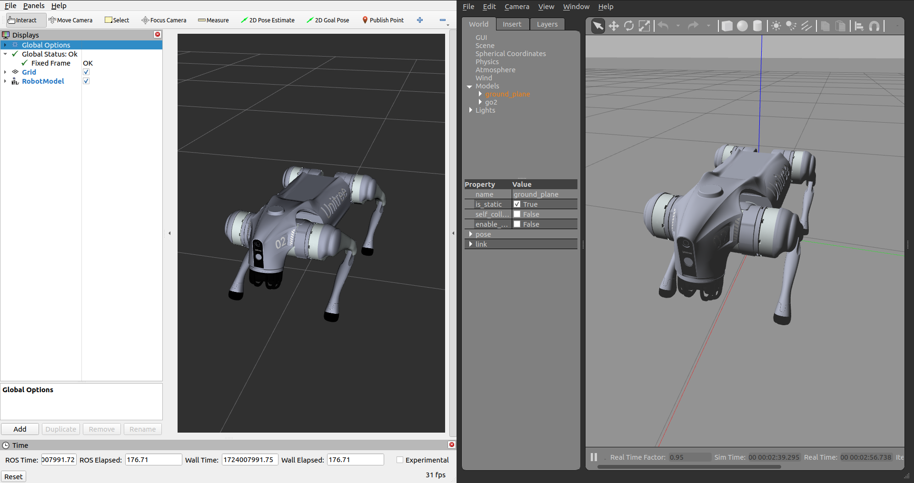
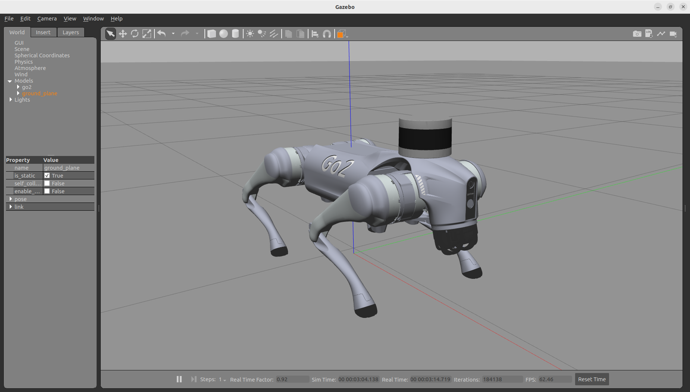
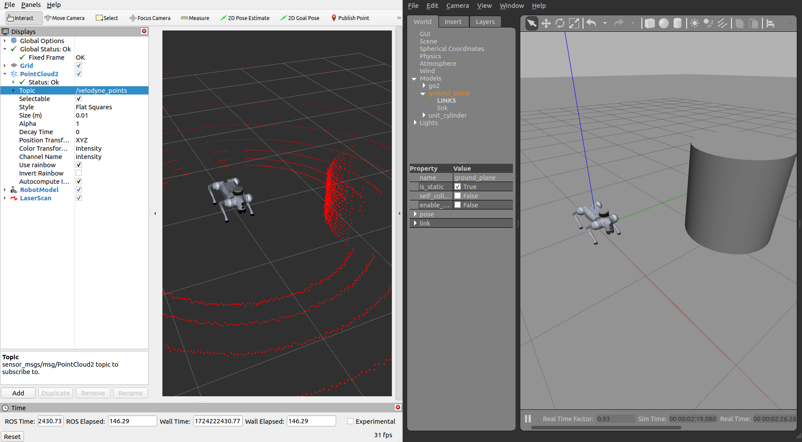

# unitree go2 ros2 - champ config

> This package contains the configuration files for the Unitree Go2 robot configured with the CHAMP controller in ROS 2 (humble). It includes development of config package along with upgrade in robot description model for ROS 2 Humble distribution.

## Unitree Go2:
<div style="display: flex; gap: 50px;">
  
   
</div>

> Unitree Robotics is focusing on the R&D, production, and sales of consumer and industry-class high-performance general-purpose legged and humanoid robots, six-axis manipulators, and so on. We attaches great importance to independent research and development and technological innovation, fully self-researching key core robot components such as motors, reducers, controllers, LIDAR and high-performance perception and motion control algorithms, integrating the entire robotics industry chain.

## CHAMP Controller:


> CHAMP is an open source development framework for building new quadrupedal robots and developing new control algorithms. The control framework is based on [*"Hierarchical controller for highly dynamic locomotion utilizing pattern modulation and impedance control : implementation on the MIT Cheetah robot"*](https://dspace.mit.edu/handle/1721.1/85490).

## Resources:
- [go2 description (URDF model)](https://github.com/unitreerobotics/unitree_ros/tree/master/robots/go2_description) 
- [champ robot (configs)](https://github.com/chvmp/robots)
- [champ controller](https://github.com/chvmp/champ)

## Tested on:
- Ubuntu 22.04 (ROS2 Humble)

## Current state of package:

- &check; Configure go2 robot with champ config
- &check; Robots Configurations.
    - &check; Porting of robot description packages to ROS 2.
    - &check; Porting of robot URDF to ROS2 (add new ros2_control tag).
    - &check; Porting of robot configurationf to ROS2.
    - &check; Porting of robot launch Files to ROS2.
- &check; Upgrade go2 description model for ros2 humble
- &check; Spawning go2 in gazebo environment.
- &check; Working rviz only demo.
- &check; Working Gazebo with teleoperated robot.
- &check; Adding IMU and 2D LiDAR.
- &check; Adding 3D LiDAR (Velodyne).
- &cross; Working Gazebo demo with SLAM.
- &cross; Working Gazebo demo with nav2 integration.

## 1. Installation

### 1.0 Install ROS-based dependencies:
```bash
sudo apt install ros-humble-gazebo-ros2-control
sudo apt install ros-humble-xacro
sudo apt install ros-humble-robot-localization
sudo apt install ros-humble-ros2-controllers
sudo apt install ros-humble-ros2-control
sudo apt install ros-humble-velodyne
sudo apt install ros-humble-velodyne-gazebo-plugins
sudo apt-get install ros-humble-velodyne-description
```

### 1.1 Clone and install all dependencies:
    
```bash
sudo apt install -y python3-rosdep
rosdep update

cd <your_ws>/src
git clone https://github.com/anujjain-dev/unitree-go2-ros2.git
cd <your_ws>
rosdep install --from-paths src --ignore-src -r -y
```

### 1.2 Build your workspace:
```bash
cd <your_ws>
colcon build
. <your_ws>/install/setup.bash
```
## 2. Quick Start

You don't need a physical robot to run the following demos. Make sure you have ros2_control, gazebo ros, controller manager packages installed in your ros2 setup.

### 2.1 Gazebo demo: Run the Gazebo environment
```bash
ros2 launch go2_config gazebo.launch.py
```


### 2.2 Walking demo in RVIZ: Run the gazebo along with rviz
```bash
ros2 launch go2_config gazebo.launch.py rviz:=true
```


### 2.3 Run the teleop node:
```bash
ros2 run teleop_twist_keyboard teleop_twist_keyboard
```
https://github.com/user-attachments/assets/bcfeec70-12c5-49b8-b7a7-da4fa9b6dea5

### 2.4 Go2 Velodyne Config Gazebo demo: Run the Gazebo environment
```bash
ros2 launch go2_config gazebo_velodyne.launch.py 
```


### 2.5 Go2 Veldyne Config Walking/PointCloud demo in RVIZ: Run the gazebo along with rviz
```bash
ros2 launch go2_config gazebo_velodyne.launch.py rviz:=true
```

> Note: set point cloud topic to `/velodyne_points`



### 2.6 Go2 Hokoyu 2D LiDAR Config Gazbeo demo: Run the Gazebo environment

> NOTE: To use Laser instead of 3D Velodyne LiDAR, comment `<xacro:include filename="$(find go2_description)/xacro/velodyne.xacro"/>` and uncomment `<xacro:include filename="$(find go2_description)/xacro/laser.xacro"/>` in `robot_VLP.xacro` file located inside `robots/description/go2_description/xacro/` folder.

```bash
ros2 launch go2_config gazebo_velodyne.launch.py 
```

To Run the gazebo along with rviz
```bash
ros2 launch go2_config gazebo_velodyne.launch.py rviz:=true
```

## 3. Tuning gait parameters

The gait configuration for your robot can be found in <my_robot_config>/gait/gait.yaml.


- **Knee Orientation** - How the knees should be bent. You can can configure the robot to follow the following orientation .>> .>< .<< .<> where dot is the front side of the robot.

- **Max Linear Velocity X** (meters/second) - Robot's maximum forward/reverse speed.

- **Max Linear Velocity Y** (meteres/second) - Robot's maximum speed when moving sideways.

- **Max Angular Velocity Z** (radians/second)- Robot's maximum rotational speed.

- **Stance Duration** (seconds)- How long should each leg spend on the ground while walking. You can set this to default(0.25) if you're not sure. The higher the stance duration the further the displacement is from the reference point.

- **Leg Swing Height** (meters)- Trajectory height during swing phase.

- **Leg Stance Height** (meters)- Trajectory depth during stance phase.

- **Robot Walking Height** (meters) - Distance from hip to the ground while walking. Take note that setting this parameter too high can get your robot unstable.

- **CoM X Translation** (meters) - You can use this parameter to move the reference point in the X axis. This is useful when you want to compensate for the weight if the center of mass is not in the middle of the robot (from front hip to rear hip). For instance, if you find that the robot is heavier at the back, you'll set a negative value to shift the reference point to the back.

- **Odometry Scaler** - You can use this parameter as a multiplier to the calculated velocities for dead reckoning. This can be useful to compensate odometry errors on open-loop systems. Normally this value ranges from 1.0 to 1.20.

## Contributing

Contributions are welcome! Please feel free to submit a Pull Request.

1. Fork the repository
2. Create your feature branch (`git checkout -b feature/AmazingFeature`)
3. Commit your changes (`git commit -m 'feat: Add some AmazingFeature'`)
4. Push to the branch (`git push origin feature/AmazingFeature`)
5. Open a Pull Request

## Acknowledgements

This project builds upon and incorporates work from the following projects:

* [Unitree Robotics](https://github.com/unitreerobotics/unitree_ros) - For the Go2 robot description (URDF model).
* [CHAMP](https://github.com/chvmp/champ) - For the quadruped controller framework.
* [CHAMP Robots](https://github.com/chvmp/robots) - For robot configurations and setup examples.

We are grateful to the developers and contributors of these projects for their valuable work.
